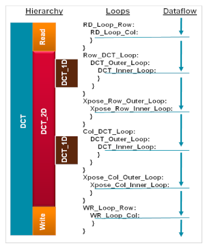

# High-Level Synthesis!

### 1.1. Aceleración de la Transforama Discreta del Coseno.

Para este laboratorio vamos a hacer uso del material generado por AMD/Xilinx. 

1. Clone el siguiente repositorio: 

     https://github.com/Xilinx/xup_high_level_synthesis_design_flow/tree/main

2. Ingrese a la carpeta **source**. Vamos a trabajar con el **lab3**, el cual implementa **Discrete Cosine Transformation** (DCT). La siguiente imagen muestra el código correspondente. 

    

3. Generar un proyecto en Vitis HLS, importando los archivos necesarios. Considere la placa de desarrollo Zedboard. 

4. Una vez generado el proyecto,  raliza la siguiente configuración:
    
    - En el menú, ve a **Project -> Project Settings** y haz clic en **Synthesis**. 

    - En la sección **Synthesis C/C++ Source files, dentro de la tabla, haz clic en la entrada myproject.cpp y luego en Edit CFLAGS. Sustituye el texto por: **-std=c++14**.
    
    - Clic **OK**. 

5. Para cada uno de los siguientes items, genere el reporte de síntesis correspondiente para efectuar la evualación de las métricas en terminos de utilización de recursos y latencia. Puede efectuar la incorporación de directivas de manera real o evaluar el impacto individual en el hardware generado. 

    - Mejorar el desempeño empleando la directiva PIPELINE.

    - Optimizar el paralelismo de grano-fino.

    - Aplicar la dirctiva DATAFLOW. 

    - Aplicar la directiva ARRAY PARTITION. 

    - Si es posible, proponga una configuración de directivas/optimizaciones. 

    - Utilice los siguientes valores de clock: 12ns, 10ns, 5ns. Comente los efectos de esta variación.

    - Finalmente, efectúe el proceso de síntesis para la siguiente parte **xc7a35tcsg325-1**. Qué puede observar?

5. Simule el proyecto para verificar la funcionalidad del mismo. 

